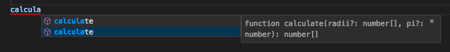

# Javascript code easy to reason about

A Training useable as a Brown Bag Lunch

## Proposed Definition
Code easy to reason about :
* Does not affect or mutate external state (ie : no side effects)
* Does not rely on external state
* Always return same output for a given input
* Have up to date documentation

## Goals
* What make code easy to reason about ?
* Why JS sometimes makes it hard to reason about ?
* Different methodologies we can use to make JS easy to reason about !

### What's this program's behavior ?

 ```Javascript
let pi = 3.14159;
function calculate(radii){
  for(let i = 0; i < radii.length; i++){
    radii[i] = pi * radii[i] * radii[i];
  }
  return radii;
}
 ```

## TDD
You can't rely on documentation like JSDoc : when code change you can't asume that documentation
is up to date. If you write tests as documentation of your code and add them
in your CI pipeline, when code change, if its covered specification change, you must
update your test.

#### First iteration
We write a first test to describe our program

```Javascript
test('area for [1]', () => {
  const radii = [1];
  const expectedResult = [3.14159 * 1 * 1];
  expect(calculate(radii)).toEqual(expectedResult);
});
```

run it

```
npm run test
```

It fail because we don't implement anything yet.
So implement a first naive implementation

```javascript
const pi = 3.14159;
export function calculate(radii){
  return pi;
}
```
re-run the test, it pass !

#### Second iteration
We want the test pass for a list of values, so we add a new test.

```Javascript
test('area for [1, 2]', () => {
  const radii = [1, 2];
  const expectedResult = [3.14159 * 1 * 1, 3.14159 * 2 * 2];
  expect(calculate(radii)).toEqual(expectedResult);
});
```

Test fails (⊙ _ ⊙)
Don't worry add the implentation


```Javascript
let pi = 3.14159;
function calculate(radii){
  for(let i = 0; i < radii.length; i++){
    radii[i] = pi * radii[i] * radii[i];
  }
  return radii;
}
```

Now test pass (•̀ᴗ•́)و

#### Third iteration
We want the function return always the same output given a same input. Add a new test :

```javascript
test('result must always be the same', () => {
  const radii = [1, 2];
  calculate(radii);
  const a = calculate(radii);
  expect(a).toEqual(calculate([1, 2]));
});
```

It fails (ಥ_ಥ) because our function mutate the input. We should create a new variable inside the function BUT we have better to use Arrays functionnal pragramming capacities. So we will use the [map](https://developer.mozilla.org/fr/docs/Web/JavaScript/Reference/Objets_globaux/Array/map) which apply a callback to each item of the array and return a new array :

```javascript
export function calculate(radii) {
  const areas = radii.map(radius => pi * radius * radius);
  return areas;
}
```
Now test pass (•̀ᴗ•́)و

#### Fourth iteration
What if the function is call with an integer ? with a string in the array ? with undefined inside the array ?
Add thoose tests :

```javascript
test('call with an integer must throw a TypeError', () => {
  const radii = 1;
  //must be wrap in an anonymous function to be test
  expect(() => calculate(radii)).toThrowError(TypeError);
});

test('call with an string or undefined in array must throw a TypeError', () => {
  const radii = [1, 'foo', undefined];
  //must be wrap in an anonymous function to be test
  expect(() => calculate(radii)).toThrowError(TypeError);
});
```

As we expect it fails (ಠᴗಠ). And we will iterate to our function.

```javascript
export function calculate(radii) {
  if (!Array.isArray(radii)) {
    throw new TypeError('Argument must be an Array');
  }
  radii.forEach(radius => {
    if (typeof radius !== 'number') {
      throw new TypeError('Argument must be an Array');
    }
  });
  const areas = radii.map(radius => pi * radius * radius);
  return areas;
}
```

Just for fun new tests :

```javascript
test('call with an string or undefined in array must throw a TypeError', () => {
  const radii = [1, Infinity, NaN];
  //must be wrap in an anonymous function to be test
  expect(() => calculate(radii)).toThrowError(TypeError);
});
```

(╥﹏╥) : [language features](https://developer.mozilla.org/fr/docs/Web/JavaScript/Reference/Op%C3%A9rateurs/L_op%C3%A9rateur_typeof)


```javascript
export function calculate(radii) {
  if (!Array.isArray(radii)) {
    throw new TypeError('Argument must be an Array');
  }
  radii.forEach(radius => {
    if (typeof radius !== 'number' || isNaN(radius) || !isFinite(radius)) {
      throw new TypeError('Argument must be an Array');
    }
  });
  const areas = radii.map(radius => pi * radius * radius);
  return areas;
}
```

Now test pass : you made TDD to develop and document your function ᕦ(ò_óˇ)ᕤ

At this moment, we can assume our tests are good enough documentation of our code... but is it safe enough ? What if another developer developer alter the code like this :

```javascript
let pi = 3.14159;

export function calculate(radii) {
  pi = 3.14;
  if (!Array.isArray(radii)) {
    throw new TypeError('Argument must be an Array');
  }
  radii.forEach(radius => {
    if (typeof radius !== 'number') {
      throw new TypeError('Argument must be an Array');
    }
  });
  const areas = radii.map(radius => pi * radius * radius);
  return areas;
}
```

Problem of globals ! You can always put declare `const pi = 3.14159;` it will protect you of mutation because pi is a javascript primitive but not if it was an object. And it will never protect you against another developer who write (variable visibility).

```javascript
const pi = 3.14159;

export function calculate(radii, pi=3.14) {
  if (!Array.isArray(radii)) {
    throw new TypeError('Argument must be an Array');
  }
  radii.forEach(radius => {
    if (typeof radius !== 'number') {
      throw new TypeError('Argument must be an Array');
    }
  });
  const areas = radii.map(radius => pi * radius * radius);
  return areas;
}
```

Tests fail (╥﹏╥) we reach the limit of tests.

#### Does TDD make code easy to reason about ?
* Does not affect or mutate external state (ie : no side effects) ✗
* Does not rely on external state ✗
* Always return same output for a given input ✓
* Have kind of up to date documentation ✓

## Type systems
Are related to [type theory](https://plato.stanford.edu/entries/type-theory/) : yes maths ¯\\\_(ツ)\_/¯

In computer science, it is strongly linked to the programming language or framework. We speak about *Dynamic* vs *Static* (consensus) and *Weak* vs *Strong* (controversial) type systems. Because there is many definitions, I propose this one :

Strong | Weak | Static | Dynamic
- |:-: |:-: |  -:
Generate a compile errors| Unpredictable runtime errors | Compiler tag piece of code |Compiler / Interpreter generate code to keep track of data
Perform type check before code run without implicit conversion | Try implicit conversion | Tries to infer if the behaviour is valid |
Well defined error set |  | Before program run |

OCaml/ReasonML, Rust or Haskell have strong and static type system.

C++ or Java have a weak and static type system.

Python, Ruby or JS have a weak & dynamic type system ! Which mean errors appens on runtime and you can't assume a program works because it runs ᕕ( ᐛ )ᕗ

Don't give up : we're here because Javascipt is amaizing ( ˘ ³˘)♥

#### Using default values for parameters
A good practice in JS is to **ALWAYS** set default parameters in your functions.

```Javascript
export function calculate(radii = [1], pi = 3.14159) {
  if (!Array.isArray(radii)) {
    throw new TypeError('Argument must be an Array');
  }
  radii.forEach(radius => {
    if (typeof radius !== 'number' || isNaN(radius) || !isFinite(radius)) {
      throw new TypeError('Argument must be an Array');
    }
  });
  const areas = radii.map(radius => pi * radius * radius);
  return areas;
}
```

This practice has 2 benefits :
* It serves as documentations for developers who modify your code : with default value you describe the shape of the parameters
* In some IDE (like VSCode) you can have usefull helpers that infer type of your parameters



#### Using a typechecker
If the first practice isn't enough in your context which means you don't trust that developers read documentation or use the right tools : you may add a type checker before runtime. That's the purpose of libraries like [Flow](https://flow.org/).

To use it, first install flow and related babel-preset `npm i -D flow-bin babel-preset-flow` then add the preset `"flow"` in `.babelrc` (already done).

To initialize your project just do `./node_modules/.bin/flow init`

We will also add a script `npm run flow` to check status.

Now we can use it in our code :
```javascript
// @flow
export function calculate(radii:Array<number>, pi:number) : Array<number> {
  const areas = radii.map(radius => pi * radius * radius);
  return areas;
}
```

The `// @flow` must be the first line of all file you want to typecheck.
Declaration of the function means calculate take as parameter : radii an array of numbre, pi a number and the function return an array of number.

We don't need to throw type errors anymore because flow will do it before runtime. But we need to remove our unit tests. Specification change (we decide to use a type checker), documentation must be updated.

**Flow** have also a great inference systems which means that it can deduce the type of a variable from another or deduce type of object literals. It's diffrent from dynamic typing because variable will be statically type before the runtime so if you then assign a value of another type to the same variable flow will raise an error (so before runtime).

Exemple
```Javascript
// @flow

const obj1: { foo: boolean } = { foo: true }; //works

const obj2 = {
  foo: 1,
  bar: true,
  baz: 'three'
}
const foo: number  = obj2.foo; // Works!
const bar: boolean = obj2.bar; // Works!
const inferbar: typeof obj1.foo = obj2.bar; // Works!
// $ExpectError
const baz: null    = obj2.baz; // Error!
const bat: string  = obj2.bat; // Error!
```

There is lot of other cool stuff in Flow and it may be a reasonable first step if you think you need a static type system.

#### Using another language that compile in Javascript
**TypeScript**, **PureScript**, **Elm** : lot of static type langs were design to compile in Javascript, some have have functionnal programming design <br/>
**ReasonML** : a static type & functionnal lang based on OCaml that compile in Javascript thanks to Bucklescript but can also run native.<br/>
**Haskell** : a static type & functionnal lang that compile in Javascript thanks to ghcjs but can also run native.

It's another level that involve you to learn a new programming language so before dive inside be sure that's what you need.

During this BBL we will not explore this possibiliy.
I advice you to read about and try [ReasonML](https://reasonml.github.io/) if you want go further in this topic.

#### Does Type system make code easy to reason about ?
* Does not affect or mutate external state (ie : no side effects) ✗
* Does not rely on external state ✗
* Always return same output for a given input ✗
* Have kind of up to date documentation ✓

## Immutability
As we have seen before, there is no immutability in JS : `const` is an immutable reference not an immutable data (you can always alter the referenced data).


[Immutable.js](https://facebook.github.io/immutable-js/) is a library made by Facebook that give you immutable data structures. A good point is that you get also more data structures.

To use immutable, install it `npm i -D immutable`

We can alter our first function like this to be sure `calculate` never alter `radii` ... so we also need to alter tests because we change specification : radii is now a List and no more an Array. Good job TDD regressions avoid (ﾉ◕ヮ◕)ﾉ*:・ﾟ✧
```Javascript
import { List } from 'immutable';

const radiiSample = List([1,2]);
function calculate(radii=List([1]), pi=3.14){
    if (!List.isList(radii)) {
      throw new TypeError('Argument must be a List');
    }
    radii.forEach(radius => {
      if (typeof radius !== 'number' || isNaN(radius) || !isFinite(radius)) {
        throw new TypeError('Argument must be an Array');
      }
    });
    const areas = radii.map(radius => pi * radius * radius);
    return areas;
  }

  console.log(calculate(radiiSample));
```

Usage with flow :
```Javascript
// @flow
import  { List } from 'immutable';

const radiiSample:List<number> = List([1,2]);
function calculate(radii:List<number>, pi:number = 3.14) : List<number>{
    const areas = radii.map(radius => pi * radius * radius);
    return areas;
  }

  console.log(calculate(radiiSample));
```

Easy “ヽ(´▽｀)ノ”

Another good point is now you have immutability it is easier and faster to compare datas. No more deepEqual required, just use the [is()](https://facebook.github.io/immutable-js/docs/#/is)


#### Does Immutability make code easy to reason about ?
* Does not affect or mutate external state (ie : no side effects) ✓
* Does not rely on external state ✗
* Always return same output for a given input ✗
* Have kind of up to date documentation ✗

## Functionnal programming
Functionnal programming is a large topic, we will focus on two concept **Pure function** and **composition**

#### Pure function
A function is only pure if, given the same input, it will always produce the same output. A pure function produces no side effects, which means that it can’t alter any external state.Pure functions are completely independent of outside state, and as such, they are immune to entire classes of bugs that have to do with shared mutable state and easy to test.

Shared state is any variable, object, or memory space that exists in a shared scope, or as the property of an object being passed between scopes.

A good practice may be to write only pure function and delegate all side effects related to a shared state at the top level of your application.

**Pure function + immutability = referential transparency**
*The ability to change an expression with its value and not change the behavior of the program*

#### Composition
In JS, you can compose your functions because functions are first class citizens :
* Refer to them as *constant* or *variable* `const foo = () => 'foo'`
* Pass them as *parameters* to other functions
* Return them as *result* from other functions

So we can write **High Order Function** : any function which takes a function as an argument, returns a function, or both.

In fact we already replace the loop by a High Order Function when we replace the loop `for` by `map` function on our array. Map is a High Order Function.

Imagine we want also calculate diameters, HOF give us a way to parametrize our function :
```Javascript
// @flow
import  { List } from 'immutable';

const calculateArea = (radius:number, pi:number = 3.14) : number => pi * radius * radius;
const calculateDiameter = (radius:number, pi:number = 3.14) : number => 2 * pi * radius;

const actionOnList = (action:(radius:number, pi:number) => number, radii:List<number>) : List<number> => radii.map(action);
```

We can use the same principe to define lot of new functions :
```Javascript
// @flow
import  { List } from 'immutable';

const list:List<number> = List([1,2]);

function calculate(radii:List<number>, pi:number = 3.14) : List<number>{
    const areas = radii.map(radius => pi * radius * radius);
    return areas;
  }

  console.log(calculate(list));


function area(radius:number, pi:number = 3.14) : number { 
    return pi * radius * radius;
}
function diameter(radius:number, pi:number = 3.14) : number {
    return 2 * pi * radius;
}
function square(x:number) :number { return x * x }
function double(x:number) :number { return x * 2 }
function negate(x:number) :number { return -x }

const actionOnList = (action:Function, values:List<number>) : List<number> => values.map(action);

const areas: List<number> = actionOnList(area, list);
const diameters: List<number> = actionOnList(diameter, list);
const doubles: List<number> = actionOnList(double, list);
const squares: List<number> = actionOnList(square, list);
const negates: List<number> = actionOnList(negate, list);
```

#### Does Functionnal programming make code easy to reason about ?
* Does not affect or mutate external state (ie : no side effects) ✓ 
* Does not rely on external state ✓
* Always return same output for a given input  ✓
* Have kind of up to date documentation ✗

## Reason a little bit more
* Thanks to [Preethi Kasireddy](https://twitter.com/iam_preethi) whose [talk](https://youtu.be/A5MmXLdNJfI) at ForwardJS San Francisco inspired this BBL
* Read [Eric Elliott](https://twitter.com/_ericelliott) about [what is Functionnal programming in JS](https://medium.com/javascript-scene/master-the-javascript-interview-what-is-functional-programming-7f218c68b3a0) and continue by reading his related others
* Watch [Anjana Vakil](https://twitter.com/anjanavakil) talk about [Functional Programming with JavaScript](https://youtu.be/e-5obm1G_FY) and about [Immutable data structures for JS](https://youtu.be/Wo0qiGPSV-s)
* Watch [Hanneli Tavante](https://twitter.com/hannelita) talk at Devoxx about [type theory for beginners](https://youtu.be/UXBoiqRJ6DQ) 
* Watch [Jeff Morrison](https://twitter.com/lbljeffmo) talk [Deep dive into flow](https://youtu.be/VEaDsKyDxkY) 
